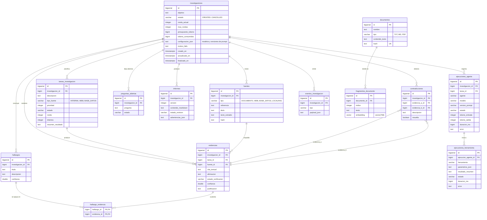

# Esquema de base de datos

PostgreSQL 16 con la extension `pgvector`. Esquema aplicado por Flyway desde
`backend/src/main/resources/db/migration/V1__esquema_base.sql`.

Convenciones:

- Tablas y columnas en espanol, `snake_case`.
- Claves primarias `BIGSERIAL` (Java `Long`).
- Estados como `VARCHAR` con `CHECK` que refleja el enum de Java.
- Llaves foraneas fisicas e indices en todas las columnas de busqueda.

## Diagrama



## Notas de diseno

### Por que `fuentes.texto_extraido` completo

La verificacion determinista necesita comprobar que la cita textual existe
literalmente en el texto de la fuente. Guardar solo un resumen o un snippet
imposibilitaria esa comprobacion, que es precisamente la garantia fuerte del
sistema.

### Por que `hallazgo_evidencia` es tabla pivote y no una columna

Un hallazgo se apoya en varias evidencias y una evidencia puede sustentar varios
hallazgos. La relacion es de muchos a muchos.

### Por que el estado es `VARCHAR` con `CHECK` y no un enum de PostgreSQL

Un `ENUM` de PostgreSQL requiere `ALTER TYPE` para anadir valores, lo que es
fragil con Flyway y bloqueante. El `CHECK` documenta el catalogo en el esquema y
se cambia con un `ALTER TABLE ... DROP CONSTRAINT / ADD CONSTRAINT`, que es una
migracion normal.

### Indice vectorial

```sql
CREATE INDEX idx_fragmentos_embedding
    ON fragmentos_documento USING ivfflat (embedding vector_cosine_ops) WITH (lists = 100);
```

Es un indice approximate (IVFFlat), que es la opcion por defecto sensata para un
corpus pequeno sin maintenance. Si el corpus crece, la alternativa exacta seria
HNSW, que se evaluaria con numeros reales en la Fase 2.

**Requisito:** la columna es `vector(768)`, la dimension de `nomic-embed-text`.
Cambiar de modelo de embeddings exige una migracion nueva que altere la dimension
y regenere los embeddings: nunca se edita una migracion aplicada.

### Sobre el usuario de solo lectura

La tool `query_database` (Fase 3) usara un usuario de PostgreSQL con solo `SELECT`.
La tabla del dataset historico de demostracion se crea en la Fase 2.

## Migraciones

| Version | Archivo | Contenido |
|---|---|---|
| 1 | `V1__esquema_base.sql` | Extension pgvector y esquema core |

Regla: **una migracion aplicada no se modifica**. Para corregir algo se crea
`V2__...` con el `ALTER` correspondiente.
